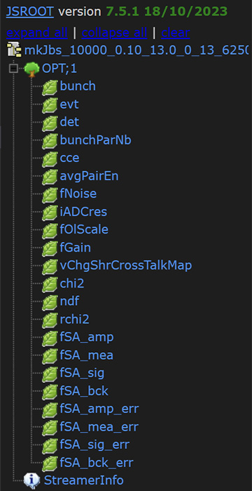
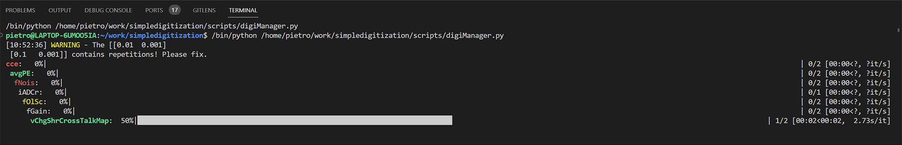

# Simplified digitization script for LUXE GP

A simple digitization script to quantify detector dependent effects degradating the ability to reconstruct the spatial distribution of the energy deposited nby an initial bunch of particles interacting with the sensitivive material.

## Table of Contents

- [Project Description](#project-description)
- [Structure of the output ROOT file](#structure-of-the-output-root-file)
- [Usage](#usage)
- [CLI parser (disclamer)](#cli-parser-disclamer)
- [Analysis](#analysis)
- [License](#license)

## Project Description

The script takes an input file produced by a Geant4 simulation, it produces a ROOT file containing the digitized information for a given set of digitization parameters. The relevant parameters for the digitization are the following

| Parameter | Type | Description |
| --- | --- | --- |
| `mcPath` | str | Filename of the MC ROOT file containing the data |
| `outPath` | str | Filename of the output ROOT file where the parameters from the feature extraction are stored |
| `bunchParNb` | int | Number of particles in a bunch |
| `cce` | float | Charge collection efficiency of the sensor for the bare geometrical projection of the dep chg. to proj chg. |
| `avgPairEn` | float | Average energy required to create an electron-hole pair in the sensor (in eV) |
| `fNoise` | float | Front-end electronics noise (in electron units) and internally converted in Coulomb |
| `iADCres` | int | Number of bits of the analog-to-digital converter (12-bit -> 12) |
| `fOlScale` | float | Full scale range that the frontend is capable of digitizing (in electron units) |
| `fGain` | float | Amplifier gain (ration between final charge and initial charge) |
| `vChgShrCrossTalkMap` | list | Cross-talk charge sharing percentages (es. [0.1,0.002, 0.0003] means that 0.1 is shared between strips at 1 distance, 0.002 between strips at distance 2, etc.) |


The pipeline is based on the following steps:
1. The input file from the Geant4 MC simulation is read bia the `readFromMc` class,
    - It converts the energy deposited in the sensitive volumes of the sensors into a charge deposited (with `avgPairEn`).
    - The charge deposited is then *geometrically projected* at the strips, effectively mapping a charge deposition at (x,y,z) into a point (x,y) on the plane of the strip. The projected charge is scaled with the `cce`.
    - The simulation of $\rm N \times M$ particles is split into M bunches $\leftrightarrow$ profiles.
    - To the charge projected at strip i-th, an uncertainty is associated by considering the population of all the strip i-th charges over the M profiles and taking the standard deviation of the distribution.
    - The output with the projected profiles (with errors) is stored in a npy file, for faster more efficient lookup in case in an another run of the script this has to be evaluated again.
2. The set of M bunches are set fed into the `frontend` class
    - The profiles are copied internally in the class variables not to overwrite the original ones.
    - Gaussian smearing noise, controlled by `fNoise` is applied to the strip charges.
    - Crosstalk between close neighboring strips is applied, controlled by `vChgShrCrossTalkMap`.
    - The strip charge is amplified by the applyAmplification method controlled by the `fGain`, defined as the ratio between the charge after amplification over the one before.
    - Finally, the profile with (smeared gaussian + crosstalk + amplification) is fed into a digitizer function, clipping the profile to the full-scale range of the digitizer (`fOlScale`) and simulating the ADC conversion with resolution of `iADCres` bits. 
3. The digitizer profiles are fed into a `featureExtractor` class. The class is supposed to represent an abstract container for arbitrary algorithms extracting some observables from the digitizer profiles and storing them on a file. In the current implementation, a fitSchemeA with a gaussian+constant fit is performed. There is a dedicated flow if the profile is saturating or not, in order to ensure *decent* fit convergence in both cases. The fit parameters are stored in a ROOT file, together with the digitizer profiles and the original profiles from the MC simulation.


## Structure of the output ROOT file
Here an example of the ROOT file produced by the simulation
<div style="margin-left: 0%; margin-right: auto;"></img></div>

Detailed description of the TBranches is inserted as TBranch title. For example the output of `OPT->Print()` and `OPT->GetBranch(branchName)->GetTitle()` where **branchName** is the TBranch name (e.g., bunch, evt, det, bunchParNb, ...)
```c++
   ------------------------------------------------------------------
  | Welcome to ROOT 6.28/04                        https://root.cern |
  | (c) 1995-2022, The ROOT Team; conception: R. Brun, F. Rademakers |
  | Built for linuxx8664gcc on Jul 08 2023, 11:06:00                 |
  | From heads/latest-stable@49886c13                                |
  | With c++ (Ubuntu 11.3.0-1ubuntu1~22.04.1) 11.3.0                 |
  | Try '.help'/'.?', '.demo', '.license', '.credits', '.quit'/'.q'  |
   ------------------------------------------------------------------

root [0] 
Attaching file /home/pietro/work/simpledigitization/data/mkJbs_10000_0.10_13.0_0_13_62500_1.000_1.000e-02,1.000e-03.root as _file0...
(TFile *) 0x55b02eca8c00
root [1] OPT->Print()
******************************************************************************
*Tree    :OPT       : Digitization opt analysis data                         *
*Entries :       10 : Total =           16812 bytes  File  Size =       5092 *
*        :          : Tree compression factor =   1.66                       *
******************************************************************************
*Br    0 :bunch     : UInt_t Bunch number                                    *
*Entries :       10 : Total  Size=        601 bytes  File Size  =        111 *
*Baskets :        1 : Basket Size=      32000 bytes  Compression=   1.00     *
*............................................................................*
*Br    1 :evt       : UInt_t Event number                                    *
*Entries :       10 : Total  Size=        593 bytes  File Size  =        109 *
*Baskets :        1 : Basket Size=      32000 bytes  Compression=   1.00     *
*............................................................................*
*Br    2 :det       : UInt_t Detector ID [0-1]                               *
*Entries :       10 : Total  Size=        641 bytes  File Size  =         95 *
*Baskets :        1 : Basket Size=      32000 bytes  Compression=   1.57     *
*............................................................................*
*Br    3 :bunchParNb : UInt_t Number of particles in a bunch                 *
*Entries :       10 : Total  Size=        639 bytes  File Size  =        100 *
*Baskets :        1 : Basket Size=      32000 bytes  Compression=   1.16     *
*............................................................................*
*Br    4 :cce       : Double_t Charge collection efficiency [0-1]            *
*Entries :       10 : Total  Size=        663 bytes  File Size  =         95 *
*Baskets :        1 : Basket Size=      32000 bytes  Compression=   1.57     *
*............................................................................*
*Br    5 :avgPairEn : Double_t Average pair creation energy [eV]             *
*Entries :       10 : Total  Size=        686 bytes  File Size  =         99 *
*Baskets :        1 : Basket Size=      32000 bytes  Compression=   1.57     *
*............................................................................*
*Br    6 :fNoise    : Double_t Frontend noise [in electrons]                 *
*Entries :       10 : Total  Size=        670 bytes  File Size  =         93 *
*Baskets :        1 : Basket Size=      32000 bytes  Compression=   1.63     *
*............................................................................*
*Br    7 :iADCres   : UInt_t Number of bits of the ADC                       *
*Entries :       10 : Total  Size=        622 bytes  File Size  =         97 *
*Baskets :        1 : Basket Size=      32000 bytes  Compression=   1.16     *
*............................................................................*
*Br    8 :fOlScale  : Double_t Fullscale range of the ADC [in electrons]     *
*Entries :       10 : Total  Size=        690 bytes  File Size  =        100 *
*Baskets :        1 : Basket Size=      32000 bytes  Compression=   1.54     *
*............................................................................*
*Br    9 :fGain     :                                                        *
*         | Double_t Gain (i.e., the ration between the amplified charge and the projected charge)*
*Entries :       10 : Total  Size=        714 bytes  File Size  =         95 *
*Baskets :        1 : Basket Size=      32000 bytes  Compression=   1.59     *
*............................................................................*
*Br   10 :vChgShrCrossTalkMap : Double_t Strip cross talk vector             *
*Entries :       10 : Total  Size=       1440 bytes  File Size  =        136 *
*Baskets :        1 : Basket Size=      32000 bytes  Compression=   6.51     *
*............................................................................*
*Br   11 :chi2      : Double_t Chi square                                    *
*Entries :       10 : Total  Size=        726 bytes  File Size  =        230 *
*Baskets :        1 : Basket Size=      32000 bytes  Compression=   1.00     *
*............................................................................*
*Br   12 :ndf       : Double_t Number of degrees of freedom                  *
*Entries :       10 : Total  Size=        740 bytes  File Size  =        105 *
*Baskets :        1 : Basket Size=      32000 bytes  Compression=   2.18     *
*............................................................................*
*Br   13 :rchi2     : Double_t Reduced chisquare (chi2/ndf)                  *
*Entries :       10 : Total  Size=        748 bytes  File Size  =        231 *
*Baskets :        1 : Basket Size=      32000 bytes  Compression=   1.00     *
*............................................................................*
*Br   14 :fSA_amp   : Double_t Fit scheme A - amplitude                      *
*Entries :       10 : Total  Size=        752 bytes  File Size  =        233 *
*Baskets :        1 : Basket Size=      32000 bytes  Compression=   1.00     *
*............................................................................*
*Br   15 :fSA_mea   : Double_t Fit scheme A - mean value                     *
*Entries :       10 : Total  Size=        753 bytes  File Size  =         94 *
*Baskets :        1 : Basket Size=      32000 bytes  Compression=   2.48     *
*............................................................................*
*Br   16 :fSA_sig   : Double_t Fit scheme A - sigma                          *
*Entries :       10 : Total  Size=        748 bytes  File Size  =         94 *
*Baskets :        1 : Basket Size=      32000 bytes  Compression=   2.48     *
*............................................................................*
*Br   17 :fSA_bck   : Double_t Fit scheme A - background value               *
*Entries :       10 : Total  Size=        759 bytes  File Size  =        233 *
*Baskets :        1 : Basket Size=      32000 bytes  Compression=   1.00     *
*............................................................................*
*Br   18 :fSA_amp_err : Double_t Fit scheme A - Error on the amplitude       *
*Entries :       10 : Total  Size=        781 bytes  File Size  =        105 *
*Baskets :        1 : Basket Size=      32000 bytes  Compression=   2.26     *
*............................................................................*
*Br   19 :fSA_mea_err : Double_t Fit scheme A - Error on the mean value      *
*Entries :       10 : Total  Size=        782 bytes  File Size  =        106 *
*Baskets :        1 : Basket Size=      32000 bytes  Compression=   2.24     *
*............................................................................*
*Br   20 :fSA_sig_err : Double_t Fit scheme A - Error on the sigma           *
*Entries :       10 : Total  Size=        777 bytes  File Size  =        106 *
*Baskets :        1 : Basket Size=      32000 bytes  Compression=   2.24     *
*............................................................................*
*Br   21 :fSA_bck_err : Double_t Fit scheme A - Error on the background value*
*Entries :       10 : Total  Size=        788 bytes  File Size  =        237 *
*Baskets :        1 : Basket Size=      32000 bytes  Compression=   1.00     *
*............................................................................*
```
> Please notice that the fSA_* are vectors! The entry 0 is for detector 0 (upstream) and the entry with array index 1 is for detector1 (downstream)


## Usage
The default phasespace is the one contained in the main call:
```python
if __name__=="__main__":
    pass
    #logging.setLevel(10)       # This correspond to debug mode
    
    # Example running the pipeline of digitization
    #pipeline()
    #exit()

    # Example running a digitization pipeline scanning a dummy phasespace
    pS = makePhaseSpace_test()
    dataDir, bunchParNb = "data/", 10000
    makeJobs("build/dummyRun_100k.root", dataDir, bunchParNb, pS)
    exit()
    
    # Example with a phasespace on A5202 physical grounds 
    #pS = makePhaseSpaceGPA5202()
    #dataDir, bunchParNb = "data/", 10000
    #makeJobs("build/dummyRun_100k.root", dataDir, bunchParNb, pS)
    #exit()
```

To run the scan using the `makePhaseSpaceGPA5202()` just comment the test PS and uncomment the corresponding line. Finally, run `python scripts/digiManager.py` in the project main directory. If you are willing to define your own phase space, then create a new function - i.e., using makePhaseSpaceGPA5202() as a template - and call it in the main function.

The application will looks like this
<div style="margin-left: auto; margin-right: auto;"></img></div>
With the various tqdm indicators showing the progress of the digitization process. The output file will be saved by default in the `data/` directory.

### CLI parser (disclamer)
There is a simple CLI parser at the end of the `digiManager.py`, which allows to run the functions defined in the global scope of the digiManager itself. However, it was quite difficult to adapt the list argument, and therefore its development is to be disregarded.


## Analysis
The idea is to load all the ROOT files produced by the simulation together in a ROOT TChain. The file `scripts/analysis.py` contains a simple example of how to do this. The script will produce a ROOT file containing a TTree with the following branches:


## License
GNU General Public License v3.0
